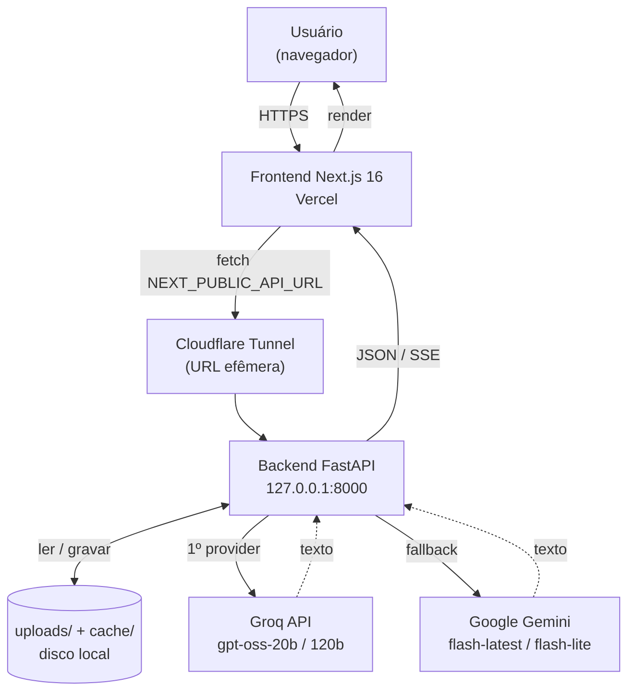
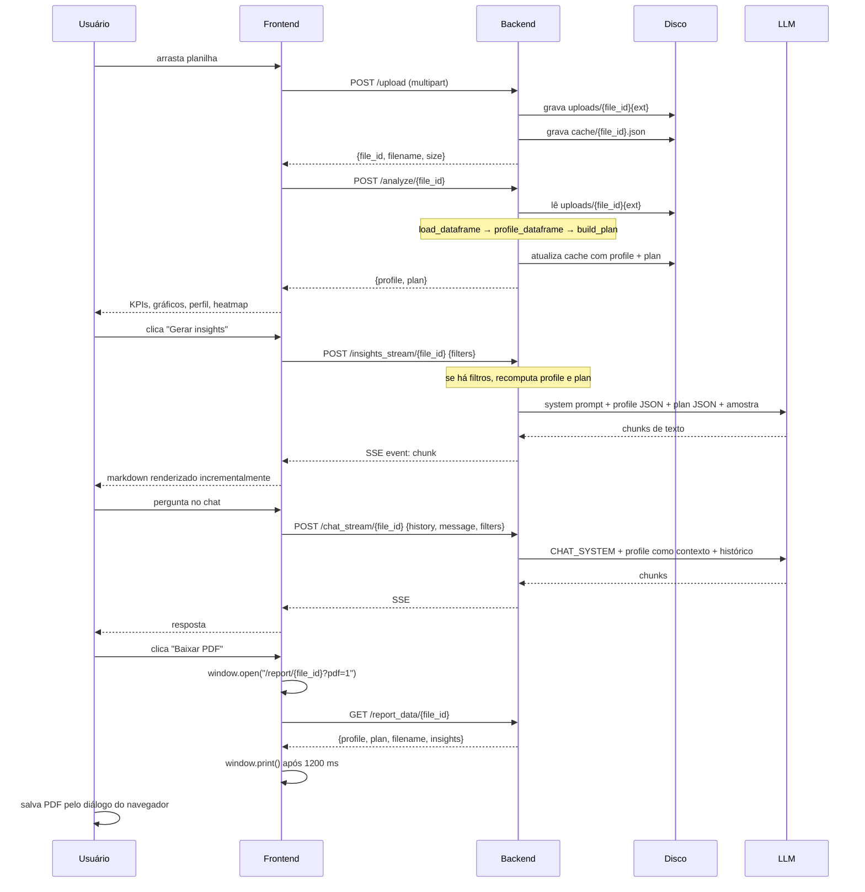
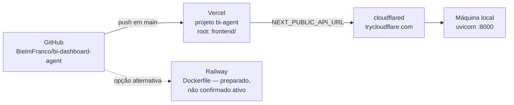

# 01 — Arquitetura Real

Reconstruída a partir do código em `backend/` e `frontend/src/`, não de documentação prévia.
Onde algo não pôde ser confirmado no código, está marcado como `UNKNOWN`.

---

## 1. Visão geral

Duas aplicações independentes que se comunicam apenas por HTTP/JSON:

- **Backend** — FastAPI monolítico, stateful em disco, sem banco de dados.
- **Frontend** — Next.js App Router, quase todo client-side, sem rotas de API próprias.

Não há autenticação, não há multi-tenancy, não há fila de jobs. Todo processamento é
síncrono dentro do request, exceto os dois endpoints de streaming (SSE).



## 2. Camadas do backend

| Camada | Arquivo | Responsabilidade |
|---|---|---|
| Transporte | `main.py` | Endpoints, CORS, rate limit, logging estruturado, tratamento global de exceção |
| Ingestão | `analyzer.py` → `load_dataframe` | Detectar encoding/separador e carregar em DataFrame |
| Profiling | `analyzer.py` → `profile_dataframe` | Tipos semânticos, nulos, estatísticas, correlação, outliers, amostra |
| Planejamento | `dashboard_planner.py` → `build_plan` | Escolher KPIs e gráficos por regras determinísticas |
| Filtragem | `filters.py` → `apply_filters` | Reduzir o DataFrame antes de reprofilar |
| Persistência | `cache.py` | Um JSON por `file_id` em `backend/cache/` |
| IA | `llm.py` | Cadeia Groq → Gemini, retry, tradução de erro |
| Prompts | `prompts.py` | System prompt e template de insights, em pt-BR |
| PDF (legado) | `pdf_export.py` | Playwright headless → bytes de PDF A4 |

### Estado do backend

O backend mantém um dicionário em memória:

```python
# backend/main.py:113
_cache: dict[str, dict] = disk_cache.load_all()
```

Cada entrada tem a forma `{path, filename, uploaded_at, profile?, plan?, insights?}`.
É restaurado do disco no import do módulo e re-salvo a cada mutação via `_persist()`.
Não há lock — o backend assume um único processo Uvicorn.

**Consequência:** rodar com `--workers > 1` quebraria a consistência do cache em memória.
Nenhum comando documentado no repositório usa múltiplos workers.

### Limpeza automática

`@app.on_event("startup")` (`main.py:118`) faz duas coisas:

1. Roda `cleanup_older_than(RETENTION_DAYS)` uma vez (padrão 7 dias).
2. Cria uma task assíncrona que repete essa limpeza a cada 6 horas.

Arquivos raw e o JSON de cache são apagados juntos.

## 3. Camadas do frontend

| Camada | Arquivo | Responsabilidade |
|---|---|---|
| Layout raiz | `src/app/layout.tsx` | Fontes, `ThemeProvider`, `Toaster`, script anti-flash de tema |
| Tema | `src/components/ThemeProvider.tsx` | Contexto próprio (light/dark/system) — **não usa `next-themes`** |
| Contrato de API | `src/lib/api.ts` | Todas as chamadas HTTP + todos os tipos TypeScript |
| Dashboard | `src/app/page.tsx` | Orquestra upload, análise, filtros, insights, chat, drill-down |
| Histórico | `src/app/history/page.tsx` | Lista, abre e apaga análises anteriores |
| Relatório | `src/app/report/[fileId]/page.tsx` | Layout A4 paisagem + auto-print |
| Componentes | `src/components/*` | KPI, gráficos, filtros, chat, insights, heatmap, modal de drill-down |
| Primitivas UI | `src/components/ui/*` | Wrappers Radix no estilo shadcn |

Todos os componentes de página são `"use client"`. Não há Server Component fazendo fetch
de dados — decisão tomada no commit `876c47b`, ver [`12_TECHNICAL_DECISIONS.md`](12_TECHNICAL_DECISIONS.md).

## 4. Fluxo de dados completo



## 5. O que é determinístico e o que é gerado

Esta separação é o núcleo do projeto e está implementada, não apenas prometida.

**Calculado por Pandas, antes de qualquer chamada de LLM:**

- contagem de linhas e colunas, nulos, `null_pct`, cardinalidade
- `min`, `max`, `mean`, `median`, `std`, `q25`, `q75`, `sum`
- contagem de outliers pela regra do IQR (1,5 × IQR)
- matriz de correlação de Pearson entre colunas numéricas
- duplicatas, colunas 100% vazias
- todos os KPIs (`dashboard_planner._build_kpis`)
- todos os dados de gráfico: séries temporais, agregações, bins, quartis, dispersão

**Gerado pelo LLM:**

- texto interpretativo dos insights (5 seções fixas)
- respostas do chat
- as 4 perguntas sugeridas no chat

O prompt em `prompts.py` reforça isso explicitamente:

> "Nunca invente dados. Baseie análises exclusivamente na planilha fornecida."
> "NUNCA multiplique média × n para estimar soma — a `sum` já vem calculada."

## 6. Comunicação em tempo real (SSE)

Dois endpoints usam `StreamingResponse` com `media_type="text/event-stream"`:
`/insights_stream/{file_id}` e `/chat_stream/{file_id}`.

O formato do evento é montado por `_sse()` em `main.py:390`:

```
event: chunk
data: <linha 1>
data: <linha 2>

```

Eventos possíveis: `chunk`, `done`, `error`.

O parser está duplicado no frontend em `insightsStream()` e `chatStream()`
(`src/lib/api.ts:183` e `:251`) — os dois blocos são praticamente idênticos.
Registrado como dívida técnica em [`14_KNOWN_LIMITATIONS.md`](14_KNOWN_LIMITATIONS.md).

Headers usados para evitar buffering de proxy:

```python
"Cache-Control": "no-cache, no-transform"
"X-Accel-Buffering": "no"
"Connection": "keep-alive"
```

## 7. Segurança

| Controle | Onde | Detalhe |
|---|---|---|
| Rate limit | `main.py`, via slowapi | Por endpoint: 5/min (export) a 30/min (analyze). Chave = IP real. |
| IP real atrás de proxy | `main.py:30` `_client_ip` | Lê `cf-connecting-ip`, depois `x-forwarded-for`, depois `request.client.host` |
| CORS | `main.py:101` | Origens de `FRONTEND_URL` + localhost; regex opcional via `FRONTEND_URL_REGEX` |
| Extensões permitidas | `main.py:77` | `.csv .xlsx .xls .xlsm .tsv` |
| Tamanho máximo | `main.py:78` | 50 MB |
| Erro genérico | `main.py:86` | Handler global devolve mensagem neutra, sem stack trace |
| Secrets no commit | `.pre-commit-config.yaml` | `detect-secrets` com baseline versionado |

**Não implementado:** autenticação, autorização, criptografia em repouso, verificação de
conteúdo do arquivo além da extensão, limite de linhas do DataFrame.

## 8. Deploy



O acoplamento crítico: `NEXT_PUBLIC_API_URL` é embutida no bundle **em tempo de build**.
`next.config.ts` faz o mapeamento:

```ts
env: {
  NEXT_PUBLIC_API_URL: process.env.NEXT_PUBLIC_API_URL || process.env.API_URL || "",
}
```

Trocar a URL do backend no Vercel exige um **redeploy**, não basta salvar a variável.

## 9. O que a arquitetura não tem

Registrado para evitar que um agente futuro procure por algo inexistente:

- Nenhum banco de dados (SQL ou NoSQL)
- Nenhum ORM
- Nenhuma migration
- Nenhuma fila (Celery, RQ, etc.)
- Nenhum Redis ou cache distribuído
- Nenhuma rota de API no Next.js (`app/api/`)
- Nenhum middleware Next.js
- Nenhum CI/CD além do deploy automático do Vercel
- Nenhum teste de frontend
- Nenhum teste de integração de endpoint (só unitários)
