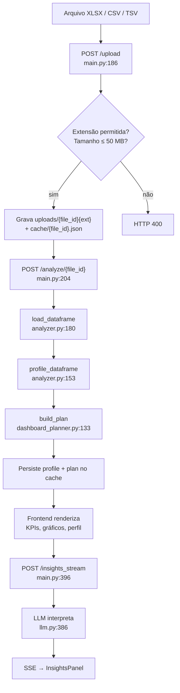

# 06 — Pipeline de Dados

Cada etapa abaixo foi confirmada no código. Referências de arquivo e linha incluídas.

---

## Visão geral



---

## Etapa 1 — Upload

**Onde:** `backend/main.py:186`

```python
ALLOWED_EXT = {".csv", ".xlsx", ".xls", ".xlsm", ".tsv"}
MAX_MB = 50
```

Validações, nesta ordem:

1. Extensão (do `filename` enviado) precisa estar em `ALLOWED_EXT` → senão HTTP 400
2. Corpo lido inteiro em memória; se exceder 50 MB → HTTP 400
3. Gera `file_id = uuid.uuid4().hex`
4. Grava em `uploads/{file_id}{ext}`, preservando a extensão original
5. Registra `{path, filename}` no cache em memória e no disco

**Limitações confirmadas:**

- O arquivo é lido inteiro em memória (`await file.read()`) antes da checagem de tamanho.
  Um upload de 500 MB ocupa 500 MB de RAM antes de ser rejeitado.
- Não há validação de conteúdo — só da extensão. Um `.exe` renomeado para `.csv` passa
  nesta etapa e falha depois no `load_dataframe`.
- Não há antivírus nem sandbox.

---

## Etapa 2 — Leitura

**Onde:** `analyzer.load_dataframe`, `analyzer.py:180`

| Extensão | Estratégia |
|---|---|
| `.csv` | Produto cartesiano: 3 encodings × 4 separadores |
| `.xlsx` `.xls` `.xlsm` | `pd.read_excel(path)` — apenas a primeira aba |
| `.tsv` | `pd.read_csv(path, sep="\t")` |

Detalhe do CSV:

```
encodings: utf-8, latin-1, cp1252
separadores: "," ";" "\t" "|"
```

Retorna o **primeiro** resultado com mais de uma coluna. Se nenhuma combinação produzir
mais de uma coluna, aceita o primeiro resultado com exatamente uma coluna e ao menos uma
linha (caso de CSV legitimamente unicolunar — corrigido no commit `256b03d`).
Se nada funcionar, levanta `ValueError`, que vira HTTP 400.

**Limitações:**

- Planilhas Excel com múltiplas abas: só a primeira é lida, sem aviso ao usuário.
- Sem `header=None` — assume que a primeira linha é o cabeçalho.
- Sem limite de linhas. Um arquivo de 50 MB com milhões de linhas é totalmente carregado.

---

## Etapa 3 — Inferência de tipo semântico

**Onde:** `analyzer._infer_semantic`, `analyzer.py:78`

Sete tipos possíveis. A ordem da avaliação importa:

| Ordem | Tipo | Condição |
|---|---|---|
| 1 | `empty` | série inteira nula |
| 2 | `datetime` | dtype já é datetime |
| 3 | `boolean` | dtype é bool |
| 4 | `id` | dtype numérico **e** `_looks_like_id` |
| 5 | `numeric` | dtype numérico |
| 6 | `id` | texto **e** `_looks_like_id` |
| 7 | `datetime_like` | > 80% de uma amostra de 50 valores parseia como data |
| 8 | `categorical` | `nunique <= max(20, 5% das linhas não-nulas)` |
| 9 | `text` | o resto |

> **Ordem `datetime_like` antes de `categorical` (corrigido 2026-09-04).** Uma coluna de
> data em texto costuma ter poucos valores distintos (12 meses, ou uma linha por dia num
> período curto) e antes caía em `categorical`, sumindo do gráfico de série temporal do
> planner. O limiar forte de 80% mantém categóricas reais (nomes, códigos, meses por
> extenso) fora deste ramo. Ver [`12_TECHNICAL_DECISIONS.md#d16`](12_TECHNICAL_DECISIONS.md).

### Detecção de identificador

`analyzer._looks_like_id`, `analyzer.py:52`. Duas condições, ambas obrigatórias:

1. O **nome** casa com um token: `id, codigo, código, cod, matricula, matrícula, cpf, cnpj, registro`
   (como palavra isolada, sufixo `_hint`, prefixo `hint_`, ou terminação)
2. A razão de valores únicos entre não-nulos é ≥ 0,6

A regra é deliberadamente conservadora. O comentário no código explica:

> "Cardinalidade sozinha é ambígua — uma coluna numérica única por linha pode ser uma
> medição (idade, salário, custo), não um identificador. Classificar erradamente uma
> métrica como ID a remove silenciosamente dos KPIs e gráficos."

Colunas classificadas como `id` são excluídas de KPIs, gráficos e da matriz de correlação.

### Parsing de datas

`analyzer._try_parse_dates`, `analyzer.py:12`. Usa `dayfirst=True` (padrão brasileiro
DD/MM/AAAA) e `format="mixed"` para evitar o `UserWarning` que o pandas emite ao cair no
dateutil linha a linha. Corrigido no commit `0e9b6ae`.

---

## Etapa 4 — Perfil estatístico

**Onde:** `analyzer.profile_dataframe`, `analyzer.py:153`

### Sempre presente, por coluna

`name`, `dtype`, `semantic`, `n`, `nulls`, `null_pct`, `unique`

### Condicional ao tipo semântico

| Semantic | Campos extras |
|---|---|
| `numeric` | `min`, `max`, `mean`, `median`, `std`, `q25`, `q75`, `sum`, `outliers_count` |
| `categorical`, `text`, `boolean` | `top_values` — top 10 `{value, count}` |
| `datetime`, `datetime_like` | `min_date`, `max_date` |

### Nível do DataFrame

| Campo | Como é calculado |
|---|---|
| `rows`, `cols` | `len(df)`, `df.shape[1]` |
| `duplicates` | `df.duplicated().sum()` — linha inteira idêntica |
| `empty_columns` | colunas com `isna().all()` |
| `correlation` | Pearson entre colunas `numeric`, 3 casas decimais. `None` se houver menos de 2. |
| `group_summaries` | Agregados por grupo: para cada categórica de baixa cardinalidade, `count` + `sum`/`mean` de cada numérica por grupo. Adicionado 2026-09-04. |
| `sample` | primeiras 20 linhas, passadas por `_safe` |
| `sample_size` | `min(20, len(df))` |

### Outliers

Regra do IQR, `analyzer.py:134`:

```python
q1, q3 = s.quantile(0.25), s.quantile(0.75)
iqr = q3 - q1
low, high = q1 - 1.5 * iqr, q3 + 1.5 * iqr
prof["outliers_count"] = int(((s < low) | (s > high)).sum())
```

Se o IQR for zero ou `NaN`, `outliers_count = 0`.

### Sanitização JSON

`analyzer._safe`, `analyzer.py:26`. Converte:

- `np.integer` → `int`
- `np.floating` → `float`, mas `NaN` e `inf` viram `None`
- `pd.Timestamp` / `np.datetime64` → string ISO
- `np.bool_` → `bool`
- qualquer `NA` → `None`

Sem isso, `json.dumps` levanta exceção em valores `NaN`. Corrigido no commit `d7706a9`.

---

## Etapa 5 — Plano de dashboard

**Onde:** `dashboard_planner.build_plan`, `dashboard_planner.py:133`

Determinístico. Nenhuma chamada de LLM.

### KPIs

- Sempre: `Total de Registros`
- Para as 4 primeiras colunas `numeric`: `Soma de X` e `Média de X`
- Colunas com zero valores não-nulos são puladas
- Truncado em 8 KPIs

### Gráficos

| Regra | Tipo | Dados calculados por |
|---|---|---|
| data + numérica | `line` — evolução mensal | `_time_series` (`freq="ME"`, soma) |
| categórica + numérica (até 2) | `bar` — top 10 | `_agg_by` (soma, ordenado desc) |
| categórica | `pie` — top 8 | `_pie` (`value_counts`) |
| numérica | `boxplot` | `_boxplot_stats` (quartis + até 50 outliers) |
| 2+ numéricas | `scatter` — até 500 pontos | pares `(x, y)` sem nulos |

Cada gráfico carrega um campo `rationale` em pt-BR explicando por que foi escolhido — o
texto é fixo por tipo, não gerado.

### Filtros sugeridos

`filters_suggested` = nomes das 3 primeiras colunas categóricas + a primeira coluna de data.

### Limitação estrutural

O planner sempre pega a **primeira** coluna de cada tipo, na ordem em que aparecem na
planilha. Não há score de relevância, variância ou cardinalidade. Uma planilha com a
coluna mais interessante na posição 40 terá gráficos ruins.

---

## Etapa 6 — Filtros

**Onde:** `filters.apply_filters`, `filters.py:25`

Três operações:

| `op` | Semântica | Coerção |
|---|---|---|
| `in` | `df[col].isin(values)` | nenhuma |
| `range` | `min ≤ valor ≤ max`, limites opcionais | numérica se o dtype for numérico; senão tenta datetime com `dayfirst=True` |
| `eq` | `df[col] == value` | nenhuma |

Máscara booleana acumulada com `&`. Comportamento defensivo: coluna inexistente, `op`
desconhecida ou `values` vazio geram warning no log e são ignorados — nunca levantam erro.

### Onde o filtro é aplicado

| Endpoint | Efeito |
|---|---|
| `POST /analyze/{id}/filtered` | Reprofila e replaneja. DataFrame vazio → HTTP 400. |
| `POST /insights` e `/insights_stream` | `_plan_for_context` recomputa perfil e plano |
| `POST /chat` e `/chat_stream` | `_profile_for_context` recomputa só o perfil |
| `POST /suggestions` | `_profile_for_context` |
| `POST /drill` | Aplica antes de selecionar as linhas |

Nos endpoints de LLM, DataFrame vazio **não** é erro — apenas loga um warning e cai para
o perfil base.

`filters.summarize_active` gera rótulos legíveis que entram em `profile["active_filters"]`
e chegam ao prompt. É assim que o LLM sabe que está falando de um recorte.

---

## Etapa 7 — Envio ao LLM

**Onde:** `llm._build_insights_prompt`, `llm.py:247`

O que é enviado, com os limites de corte:

| Bloco | Origem | Limite |
|---|---|---|
| `profile_json` | `profile` **sem** o campo `sample` | 40.000 caracteres |
| `plan_json` | `kpis`, `charts` **sem** o campo `data`, `filters_suggested` | 10.000 caracteres |
| `sample_json` | `profile["sample"]` (20 linhas) | 15.000 caracteres |

Os dados brutos dos gráficos são removidos antes do envio — o modelo recebe os metadados
do gráfico (título, tipo, rationale), não as séries. Isso reduz drasticamente o tamanho do
prompt.

No chat, o contexto é ainda menor: `llm._chat_contents` (`llm.py:400`) envia o perfil sem
`sample`, truncado em 20.000 caracteres, como primeira mensagem da conversa.

---

## Etapa 8 — Resposta ao frontend

| Endpoint | Formato |
|---|---|
| `/analyze`, `/analyze/filtered` | JSON `{profile, plan}` |
| `/report_data` | JSON `{profile, plan, filename, insights}` |
| `/insights_stream`, `/chat_stream` | SSE — eventos `chunk`, `done`, `error` |
| `/drill` | JSON `{column, value, total, columns, rows}` |

---

## Tipos de dado suportados

| Formato | Extensão | Observação |
|---|---|---|
| CSV | `.csv` | Encoding e separador autodetectados |
| Excel | `.xlsx`, `.xls`, `.xlsm` | Só a primeira aba |
| TSV | `.tsv` | Separador fixo `\t` |

Não suportados: `.ods`, `.parquet`, `.json`, `.txt`, arquivos comprimidos, Google Sheets.

---

## Tratamento de valores ausentes

| Situação | Comportamento |
|---|---|
| Coluna 100% nula | `semantic = "empty"`, entra em `empty_columns`, excluída de KPIs e gráficos |
| Coluna parcialmente nula | Nulos contados em `nulls`/`null_pct`; estatísticas calculadas só sobre os não-nulos |
| `NaN` numérico | Vira `None` no JSON via `_safe` |
| `NaN` em agregação | `groupby(dropna=True)` exclui a chave nula |
| KPI de coluna sem não-nulos | Pulado em `_build_kpis` |

---

## Erros possíveis no pipeline

| Etapa | Erro | Resposta |
|---|---|---|
| Upload | Extensão inválida | 400 `"Extensão não suportada: .xyz"` |
| Upload | Acima de 50 MB | 400 `"Arquivo excede 50MB"` |
| Análise | `file_id` desconhecido | 404 `"file_id não encontrado. Faça upload novamente."` |
| Leitura | Nenhuma combinação decodifica | 400 `"Falha ao ler arquivo: ..."` |
| Filtro | Resultado vazio (`/analyze/filtered`) | 400 `"Filtros resultaram em 0 registros."` |
| Drill | Coluna inexistente | 400 `"Coluna 'X' não existe"` |
| LLM | Sem análise em cache | 400 `"Rode /analyze antes."` |
| LLM | Falha do provider | 500 com mensagem traduzida em pt-BR |
| Qualquer | Exceção não tratada | 500 `"Erro interno. Tente novamente ou contate o mantenedor."` |
