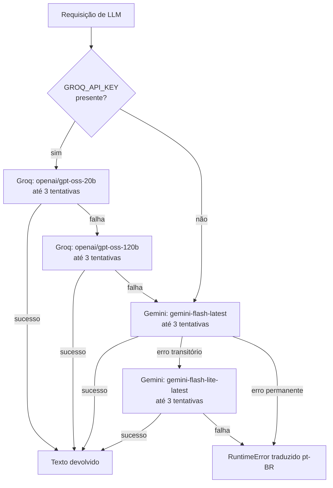

# 07 — Camada de IA / LLM

Todo o comportamento descrito aqui está em `backend/llm.py` (459 linhas) e
`backend/prompts.py` (93 linhas).

---

## 1. A separação que define o projeto

### Determinístico — calculado por Pandas, antes de qualquer chamada de LLM

- contagem de linhas, colunas, nulos, `null_pct`, cardinalidade
- `min`, `max`, `mean`, `median`, `std`, `q25`, `q75`, `sum`
- contagem de outliers (regra do IQR)
- matriz de correlação de Pearson
- duplicatas e colunas vazias
- **todos os KPIs**
- **todos os dados de gráfico** — séries temporais, agregações, bins, quartis, dispersão

### Gerado pelo LLM

- texto interpretativo dos insights (5 seções)
- respostas do chat
- as 4 perguntas sugeridas no chat

O LLM **nunca** produz um número que apareça como KPI ou ponto de gráfico. Ele recebe o
perfil já calculado e escreve prosa sobre ele. Isso está reforçado no prompt e é
verificável no código: `main.py` chama `profile_dataframe` e `build_plan` **antes** de
qualquer função de `llm.py`.

---

## 2. Cadeia de providers

Ordem de tentativa, implementada em `llm._call` (`llm.py:184`) e `llm._open_stream` (`llm.py:323`):



### Modelos e variáveis

| Papel | Variável | Padrão no código |
|---|---|---|
| Groq primário | `GROQ_MODEL_ID` | `openai/gpt-oss-20b` |
| Groq secundário | `GROQ_FALLBACK_MODEL_ID` | `openai/gpt-oss-120b` |
| Gemini primário | `MODEL_ID` | `gemini-2.0-flash` (`llm.py:153`) |
| Gemini secundário | `FALLBACK_MODEL_ID` | `gemini-flash-lite-latest` (`llm.py:43`) |

> **Divergência confirmada:** o padrão de `MODEL_ID` no código (`llm.py:153`) é
> `gemini-2.0-flash`, mas `.env.example` e `main.py:162` usam `gemini-flash-latest`.
> Na prática o `.env` define o valor, então o padrão do código raramente é usado.
> Registrado em [`14_KNOWN_LIMITATIONS.md`](14_KNOWN_LIMITATIONS.md).

### Se nenhuma key estiver configurada

`groq_client()` devolve `None` (sem key ou sem SDK) e a cadeia pula direto para o Gemini.
`client()` levanta `RuntimeError` com instrução acionável:

> "GOOGLE_API_KEY não definida. Crie backend/.env com sua key do Google AI Studio."

O backend sobe normalmente; apenas os endpoints de LLM retornam 500.

---

## 3. Retry e detecção de erro transitório

```python
MAX_RETRIES = int(os.environ.get("LLM_MAX_RETRIES", "3"))
RETRY_BASE_DELAY = float(os.environ.get("LLM_RETRY_BASE_DELAY", "1.5"))
```

Backoff exponencial: `RETRY_BASE_DELAY * 2^(tentativa - 1)`.

A espera só ocorre quando `attempt < MAX_RETRIES`, então com o padrão de 3 tentativas os
sleeps reais são **1,5 s e 3 s** — a terceira tentativa falha sem esperar. Total de
**4,5 s por modelo**.

**Só erros transitórios são retentados.** Erro de autenticação falha na primeira tentativa.

### `_is_transient` (Gemini) — `llm.py:119`

Verdadeiro para:
- `genai_errors.ServerError` (qualquer)
- `ClientError` com código 500, 502, 503, 504
- mensagem contendo `unavailable`, `overloaded`, `high demand`
- qualquer exceção com `timeout`, `temporarily`, `connection reset`

Falso para 401, 403, 429 e 400.

### `_groq_is_transient` — `llm.py:75`

Verdadeiro para:
- `APIConnectionError`
- `APIStatusError` com status 500, 502, 503, 504, 408, **429**
- mensagem com `timeout`, `temporarily`, `unavailable`

> Nota: o Groq trata 429 como transitório; o Gemini não. Diferença intencional — a quota
> do Groq é por minuto (vale esperar), a do Gemini é diária (não adianta esperar segundos).

---

## 4. Tradução de erro

`llm._translate_error` (`llm.py:274`) converte exceções de SDK em `RuntimeError` com
mensagem em pt-BR e ação sugerida:

| Condição | Mensagem ao usuário |
|---|---|
| 401 / "api key" / "unauthenticated" | "Key inválida. Verifique GOOGLE_API_KEY em backend/.env. Pegue uma em https://aistudio.google.com/apikey" |
| 429 / "quota" / "rate" | "Quota Gemini atingida (1500 req/dia no free tier). Aguarde ou faça upgrade." |
| 400 | "Requisição inválida ao Gemini: ..." |
| 403 | "Acesso negado. Key sem permissão para este modelo." |
| 503 / "unavailable" / "overloaded" | "Gemini sobrecarregado no momento. Já tentamos automaticamente algumas vezes e mudamos pra modelo secundário. Aguarde ~30s e tente novamente." |

Essas mensagens chegam ao usuário final via `HTTPException(500, str(e))` ou como
`event: error` no SSE.

---

## 5. Normalização entre providers

O Groq usa a API estilo OpenAI (`messages` com `role`/`content`); o Gemini usa
`types.Content` com `parts`. A camada de compatibilidade:

### Entrada — `_groq_messages` (`llm.py:65`)

Converte `list[types.Content]` para `list[dict]`, mapeando `role="model"` → `"assistant"`.

E injeta o reforço de idioma:

```python
PT_BR_ENFORCE = (
    "\n\nIMPORTANTE: Responda SEMPRE e EXCLUSIVAMENTE em português brasileiro (pt-BR). "
    "Nunca use inglês, mesmo em títulos, cabeçalhos ou termos técnicos comuns."
)
```

Só é aplicado ao Groq. Os modelos `gpt-oss` tendem a responder em inglês sem esse reforço;
o Gemini segue o `SYSTEM_PROMPT` (já em português) sem precisar.

Coberto por `tests/test_llm_chain.py::test_pt_br_enforce_injected_in_groq_messages`.

### Saída — iteradores de stream

| Função | Linha | Extrai de |
|---|---|---|
| `_iter_groq_stream` | 306 | `chunk.choices[0].delta.content`, ignorando `None` e erros de índice |
| `_iter_gemini_stream` | 316 | `chunk.text` |

Ambos devolvem `Iterator[str]`, de modo que `main.py` não sabe qual provider respondeu.

Coberto por `tests/test_llm_chain.py::test_iter_groq_stream_yields_content`.

---

## 6. Configuração de geração

| Parâmetro | Valor | Onde |
|---|---|---|
| `temperature` | 0.4 | ambos os providers |
| `max_tokens` (insights) | 8000 | `generate_insights`, `generate_insights_stream` |
| `max_tokens` (chat) | 4000 | `chat`, `chat_stream` |
| `max_tokens` (sugestões) | 1000 | `suggest_questions` |

O comentário em `_base_config` (`llm.py:156`) explica o orçamento generoso:

> `max_output_tokens` precisa cobrir os tokens de *thinking* (o Gemini 2.5+ consome
> silenciosamente ~2500–3000 em cadeia de raciocínio) **e** os tokens visíveis.
> Definir `thinking_budget=0` é rejeitado pelo `gemini-flash-latest` com 400 INVALID_ARGUMENT.

Foi essa a causa de outputs truncados antes do commit `58c1612`.

---

## 7. Prompts

### `SYSTEM_PROMPT`

Persona: "Especialista Sênior em Business Intelligence, Ciência de Dados, Estatística e
Visualização de Dados".

Regras de dados:
- nunca inventar dados
- números vêm sempre do perfil estatístico entregue no contexto
- explicar o raciocínio
- alertar sobre inconsistências antes de concluir

Regras de formatação (todas nascidas de problemas reais observados):
- apenas Markdown padrão + GFM
- **proibido ASCII art** — o modelo desenhava dashboards com `+---+` e `|`
- **proibido LaTeX** — `$...$` quebrava o `react-markdown`
- números em pt-BR: `1.857`, `50,28`, `12,5%`
- não repetir KPIs e gráficos que o motor já renderiza

Estrutura fixa de saída, cinco seções com títulos exatos:

1. Resumo da Base
2. Análise Exploratória
3. Dashboard Proposto
4. Insights Estratégicos
5. Próximas Análises

### `INSIGHTS_USER_TEMPLATE`

Preenchido com `profile_json`, `plan_json`, `sample_json` e `sample_n`. Termina com seis
instruções finais, incluindo: "Se alguma coluna estiver 100% nula ou for identificador,
ignore-a nas métricas."

### `CHAT_SYSTEM`

`SYSTEM_PROMPT` mais três blocos:

**Como usar o perfil** — o bloco anti-alucinação:

> "O perfil estatístico já contém, para cada coluna numérica, os campos `sum`, `mean`,
> `median`, `min`, `max`, `std`, `n`, `nulls`, `outliers_count`. Use esses números
> DIRETAMENTE. NUNCA responda 'não tenho dados suficientes' se o campo estiver presente.
> NUNCA multiplique média × n para estimar soma — a `sum` já vem calculada."

**Agregações por grupo** (adicionado 2026-09-04):

> "Se o perfil contiver `group_summaries`, ele traz, para cada dimensão categórica, a lista
> de grupos com `count` e, por métrica numérica, `sum` e `mean` já calculados. Use para
> responder 'qual X tem maior/menor soma/média de Y', rankings e comparações. NÃO responda
> que seria necessário agrupar — o agrupamento já está lá."

Motivo: antes, o perfil só carregava estatística por coluna. Perguntas como "qual produto
tem maior média" não tinham número de apoio e o modelo recusava corretamente (sem alucinar),
mas era uma recusa frustrante. `group_summaries` (calculado por `analyzer._group_summaries`)
fornece os agregados. Ver [`12_TECHNICAL_DECISIONS.md#d17`](12_TECHNICAL_DECISIONS.md).

**Filtros ativos:**

> "Se o perfil contiver `active_filters`, o usuário aplicou filtros no dashboard. Todos os
> números do perfil já refletem esse subconjunto filtrado."

**Formato:** respostas curtas (1–3 parágrafos), números em pt-BR, sem ASCII art, sem LaTeX.

---

## 8. O que cada função envia ao modelo

| Função | System prompt | Conteúdo | Limites |
|---|---|---|---|
| `generate_insights` / `_stream` | `SYSTEM_PROMPT` | perfil (sem `sample`) 40k · plano (sem `data` dos gráficos) 10k · amostra 15k | 8000 tokens |
| `chat` / `chat_stream` | `CHAT_SYSTEM` | perfil (sem `sample`) 20k como 1ª mensagem, resposta fixa "Base carregada. Pode perguntar.", histórico, mensagem nova | 4000 tokens |
| `suggest_questions` | prompt curto próprio | perfil (sem `sample`) 15k | 1000 tokens |

O campo `data` de cada gráfico é removido antes do envio (`llm.py:252`) — o modelo recebe
título, tipo e rationale, não as séries. Redução drástica no tamanho do prompt.

### Pós-processamento em `suggest_questions`

```python
lines = [ln.strip().lstrip("-•* ").rstrip("?.") for ln in text.split("\n") if ln.strip()]
lines = [ln + "?" for ln in lines if ln]
return lines[:4]
```

Remove marcadores de lista, normaliza a pontuação e trunca em 4. Se o modelo devolver
prosa em vez de uma lista, o resultado fica estranho mas não quebra — o frontend tem
fallback estático de 4 sugestões.

---

## 9. Recarga de credenciais em runtime

```python
# llm.py:55 e llm.py:140
load_dotenv(override=True)
```

Chamado dentro de `groq_client()` e `client()`, ou seja, a cada request. Permite trocar a
API key no `.env` sem reiniciar o backend. O cliente só é reconstruído se a key mudou:

```python
if _client is None or _client_key != key:
    _client = genai.Client(api_key=key)
```

**Custo:** uma leitura de arquivo por chamada de LLM. Irrelevante no volume atual.

---

## 10. Cobertura de testes

`backend/tests/test_llm_chain.py` — 12 testes:

| Teste | Verifica |
|---|---|
| `test_is_transient_503` | `ServerError(503)` é transitório |
| `test_is_transient_401_not` | `ClientError(401)` **não** é transitório |
| `test_is_transient_timeout_string` | Exceção genérica com "timeout" é transitória |
| `test_groq_transient_503` | `APIStatusError(503)` do Groq é transitório |
| `test_groq_transient_401_not` | `APIStatusError(401)` do Groq **não** é |
| `test_call_groq_success_no_gemini` | Sucesso no Groq nunca chama o Gemini |
| `test_call_groq_all_fail_falls_to_gemini` | Falha total do Groq cai para o Gemini |
| `test_call_gemini_success_when_no_groq_key` | Sem key Groq, vai direto ao Gemini |
| `test_call_all_fail_raises` | Falha total levanta `RuntimeError` |
| `test_groq_models_chain_has_fallback` | A cadeia Groq tem modelos distintos |
| `test_pt_br_enforce_injected_in_groq_messages` | O reforço de pt-BR entra na mensagem de sistema |
| `test_iter_groq_stream_yields_content` | O iterador pula deltas nulos |

Todos passam. **Nenhum teste faz chamada real de API** — tudo com `unittest.mock.patch`.

---

## 11. Limitações da camada de IA

- **Sem circuit breaker.** Se o Groq estiver fora do ar, cada request paga 6 tentativas
  (2 modelos × 3 tentativas) antes de chegar ao Gemini. Espera acumulada só em backoff:
  **~9 s** (2 × 4,5 s), fora o tempo das próprias chamadas que falham.
- **Sem cache de prompt.** Chamadas idênticas custam tokens de novo.
- **Sem contagem de tokens.** Os limites de corte são em caracteres, não em tokens.
- **`/health` não expõe o estado da cadeia** — só diz se existe uma key de Gemini
  (`has_api_key`), ignorando o Groq.
- **Sem observabilidade de custo ou latência por provider** além das linhas de log.
